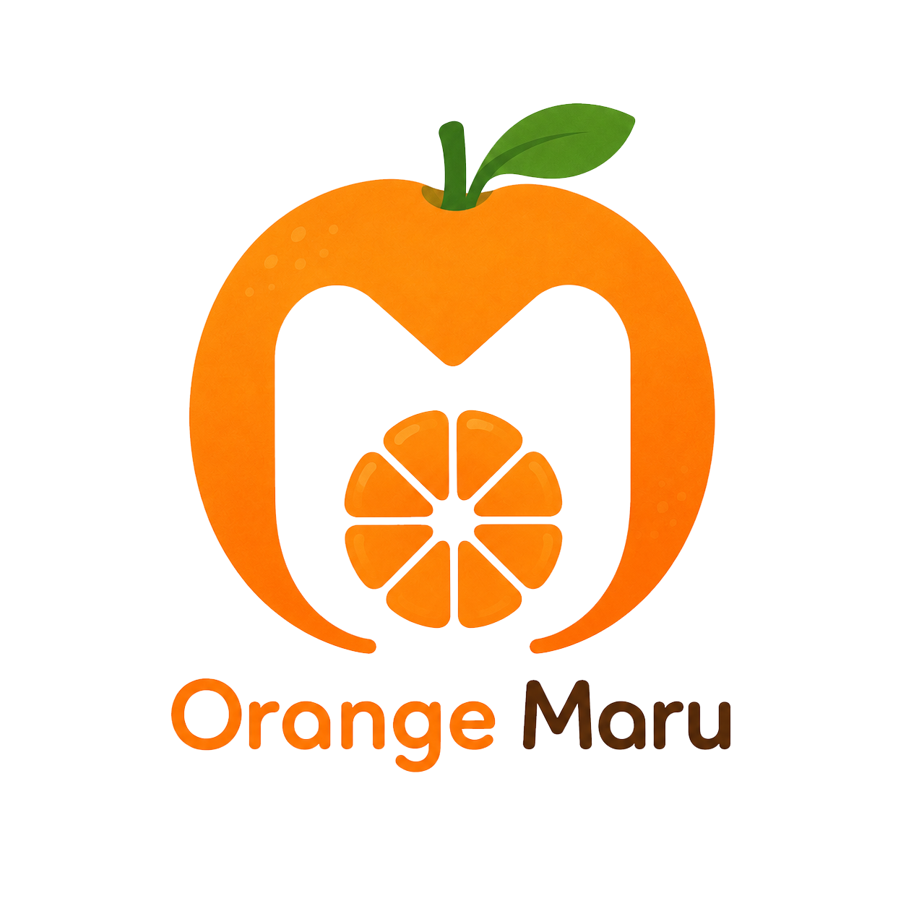
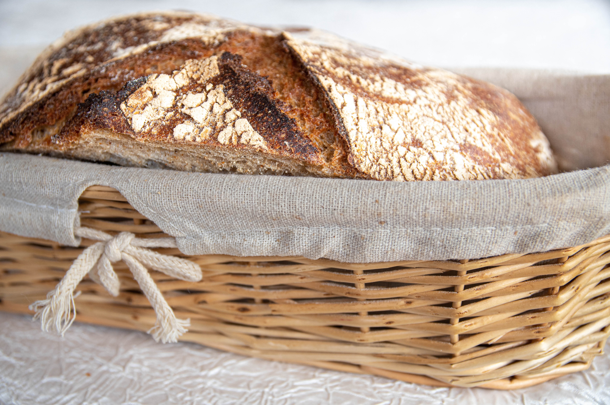

# 圓橙橙烘焙坊網站維護規格

## 專案概述

本專案為圓橙橙烘焙坊首頁靜態網站，使用 Bootstrap 5 本地端檔案作為版面框架，並以自訂 CSS 控制品牌色、輪播、產品卡與頁尾樣式。

目前主要頁面為 `index.html`。

## 目錄結構

```text
.
├── AGENTS.md
├── index.html
├── css/
│   ├── bootstrap.min.css
│   └── style.css
├── js/
│   └── bootstrap.bundle.min.js
└── images/
    ├── logo.png
    └── 其他首頁、輪播、產品與關於我們圖片
```

## 技術與引用規範

- Bootstrap CSS 使用本地檔案：`css/bootstrap.min.css`
- Bootstrap JS 使用本地檔案：`js/bootstrap.bundle.min.js`
- 自訂樣式集中維護於：`css/style.css`
- 不使用 CDN，避免離線或交付環境無網路時樣式失效。
- 目前未使用 Bootstrap Icons；頁尾社群連結以文字 `IG`、`FB`、`LINE` 呈現。

`index.html` 的 CSS 載入順序不可顛倒：

```html
<link href="css/bootstrap.min.css" rel="stylesheet">
<link href="css/style.css" rel="stylesheet">
```

Bootstrap 要先載入，自訂樣式才會正確覆蓋 Bootstrap 預設樣式。

## 頁面區塊

`index.html` 由上到下包含：

1. 頁首選單
2. 首頁輪播圖 5 張
3. 關於我們，左圖右文
4. 產品介紹，4 個 Bootstrap card
5. 頁尾資訊，含 logo、社群連結、公司資訊、版權宣告

## Logo 維護

目前頁首與頁尾 logo 都使用：

```text
images/logo.png
```

頁首位置：

```html

```

頁尾位置：

```html

```

若更換 logo，建議直接覆蓋 `images/logo.png`，這樣不需要修改 HTML。

## 輪播圖維護

輪播區塊 id 為：

```html
id="bakeryCarousel"
```

目前共有 5 張輪播圖，圖片皆放在 `images/` 資料夾。

第一張輪播使用滿版橫幅效果，HTML 結構包含：

```html
<div class="hero-slide hero-slide-cover">
  
  <div class="hero-title">Orange Maru Bakery</div>
</div>
```

第一張輪播會顯示 `Orange Maru Bakery` 文字，並使用 `.hero-slide-cover` 讓圖片鋪滿 100% 橫幅。

其他輪播圖使用 `.hero-slide`，CSS 以 `object-fit: contain` 顯示圖片全貌，避免裁切。

相關樣式在 `css/style.css`：

- `.hero-slide`
- `.hero-slide img`
- `.hero-slide-cover img`
- `.hero-title`

若希望所有輪播都滿版裁切，可將 `.hero-slide img` 的 `object-fit` 從 `contain` 改為 `cover`。

## 產品卡維護

產品區塊 id 為：

```html
id="products"
```

每個產品使用 Bootstrap card，圖片 class 為：

```html
class="product-image"
```

產品圖片樣式在 `css/style.css`：

```css
.product-image {
  width: 100%;
  aspect-ratio: 4 / 3;
  object-fit: cover;
}
```

建議產品圖片比例使用 4:3 或接近 4:3，畫面最穩定。

## 關於我們圖片

關於我們圖片使用：

```html
class="about-image"
```

樣式在 `css/style.css` 的 `.about-image`，桌機高度 340px，手機高度 260px。

## 品牌色與文字樣式

主要色彩變數集中於 `css/style.css` 最上方：

```css
:root {
  --bakery-ink: #2d261f;
  --bakery-muted: #7b7169;
  --bakery-line: #ddd4ca;
  --bakery-cream: #fffaf4;
  --bakery-peach: #f4c5a3;
  --bakery-peach-dark: #d28d61;
}
```

頁首品牌文字使用 `--bakery-ink`，hover 使用 `--bakery-peach-dark`，避免出現瀏覽器預設藍色連結。

## 圖片路徑注意事項

- 圖片統一放在 `images/`
- 檔名若含空白，HTML 中需使用 `%20`
- 建議後續圖片檔名使用英文、數字、連字號，例如：

```text
banner-1.jpg
banner-2.jpg
about-bakery.jpg
product-sourdough.jpg
```

這樣可降低路徑錯誤與跨平台問題。

## 常見修改位置

- 修改選單文字：`index.html` 的 `<nav>`
- 修改輪播圖片：`index.html` 的 `#bakeryCarousel`
- 修改輪播高度：`css/style.css` 的 `.hero-slide`
- 修改產品卡：`index.html` 的 `#products`
- 修改產品卡樣式：`css/style.css` 的 `.product-card`、`.product-image`
- 修改頁尾資訊：`index.html` 的 `<footer id="contact">`
- 修改品牌色：`css/style.css` 的 `:root`

## 維護約定

- 自訂 CSS 請新增或修改在 `css/style.css`，不要寫回 `index.html` 的 `<style>`。
- Bootstrap 原始檔案請避免直接修改，方便未來升級或替換。
- 不使用 CDN，新增第三方套件時也建議放在本地資料夾。
- 若新增其他頁面，請沿用相同 CSS/JS 引用方式。
